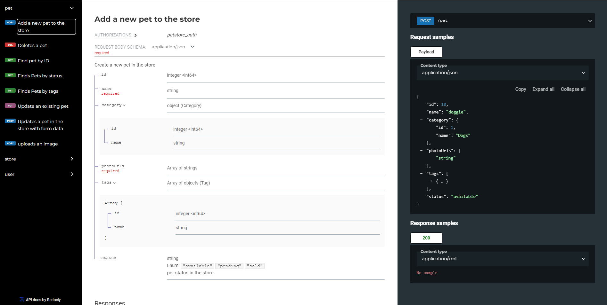

# Redoc project generator

This is simple tool for generating a [Redoc](https://github.com/Redocly/redoc) project and can work smoothly with [Redocly](https://redocly.com/docs/cli).

The idea is very basic:
* Create an API documentation page based on OpenAPI specification.
* Run, manage project with Redocly.
* Track changes from OpenAPI then update the project.

Versions tested:
* Redocly CE (community edition) version ``1.12.2``
* OpenAPI version ``3``

### Sample API doc page generated by this tool


# Install
```shell
npm i -g redoc-project-generator
```
Check with ``docgen`` command:
 ```
 docgen version
 ``` 
Or clone project if you wanna customize: [https://github.com/chenhuang511/redoc-generator](https://github.com/chenhuang511/redoc-generator)
## Install Redocly CLI
Redocly is needed for running our project. We can use some another ways to manage, run a Redoc project, but in my context, I use Redocly.

Install:
   ```shell
   npm i -g @redocly/cli@latest
   ```
Or checkout the official document from Redocly [here](https://redocly.com/docs/cli/installation/).

# Usage commands
## Initialize new project
At the **empty folder** run following command to init project:
   ```shell
   docgen init <url>
   ```
where ``url`` is the OpenAPI specification URL you want to check out.

For example, with a typical OpenAPI specs [Petstore](https://petstore3.swagger.io/):
   ```shell
   docgen init https://petstore3.swagger.io/api/v3/openapi.json
   ```
the result will be:
   ```shell
   D:\14-APIDOC-GENERATOR\test>docgen init https://petstore3.swagger.io/api/v3/openapi.json
   Generating redoc project for url: https://petstore3.swagger.io/api/v3/openapi.json ...
   Created folder: assets
   Created folder: assets/img
   Created folder: info
   Created folder: info/api
   Created folder: samples
   Created folder: samples/request
   Created folder: samples/response
   Created file: D:\14-APIDOC-GENERATOR\test\info\home.md
   Created file: D:\14-APIDOC-GENERATOR\test\README.md
   Created file: D:\14-APIDOC-GENERATOR\test\redocly.yml
   Generated standard folders and files
   Generating standard contents ...
   Generated sample request, response, info files
   Modified redocly config file
   Write log...
   Init process is done
   ```
About the project structure, please see **Structure** part for more details.

## Run project
Use redocly to run the project, at the root directory of the project (where we run the ``init`` command):
   ```shell
   redocly preview-docs 
   ```
The document website will be served on port ``8080`` (default of redocly), and we can access with URL ``http://localhost:8080``.

You may want to change the port because ``8080`` is too easily conflict with another application.
   ```shell
   redocly preview-docs --port=8041
   ```
More commands and information can be referred from [Redocly website](https://redocly.com/docs/cli/commands/preview-docs/).

## Update project
When some API(s) are added, or removed, or just changed the request/response, we can automatically change our API documents as well.

At the root directory of the project, run:
   ```shell
   docgen update
   ```

By default, the tool backups all files that will be removed in the update process (files related to removed APIs from specs).

We also can run ``docgen update --no-backup`` (without backup process), but it's not safe.

# Project structure
When we ``init`` new project, the following structure will be auto generated:
   ```
project_root
│   README.md
│   redocly.yml
│   runLog.json    
│
└───assets
│   └───img
│
└───backup
|   
└───info
|    | home.md
|    └───api
|
└───samples
|   └───request
|   └───response   
   ```
* **assets**: contains images you may add into description files on **info/** and **sample/**
* **backup**: for backup files that are removed in the update process.
* **info**: descriptions of all APIs, use markdown for writing. ``home.md`` is just the description of main documentation webpage.
* **samples**: sample requests, responses of each API, use yml for writing.
* **redocly.yml**: main config file of redocly project.
* **runLog.json**: init, update logs will be logged here. The update process also need this log file for detecting changes between OpenAPI specs and project generated resources.

## Sample request content
Imagine you want to add sample ``application/json`` request body for API ``addPet``, like that:
   ```json
  {
      "id": 10,
      "name": "doggie",
      "category": {
         "id": 1,
         "name": "Dogs"
      },
      "photoUrls": [
         "string"
      ],
      "tags": [
         {
            "id": 0,
            "name": "string"
         }
      ],
      "status": "available"
   }   
   ```
then you just add bellow yml content into ``samples/request/addPet.yml`` file:
   ```yaml
   Add pet sample request:
   summary: 'add pet request body sample'
   value:
      id: 10
      name: doggie
      category:
         id: 1
         name: Dogs
      photoUrls:
         - string
      tags:
         - id: 0
           name: string
      status: available
   ```
Sample request will be displayed on right panel of the documentation webpage.

> 3 first lines are required for each sample yml file. All things under ``value`` key are the same with above json message.

# License
MIT
